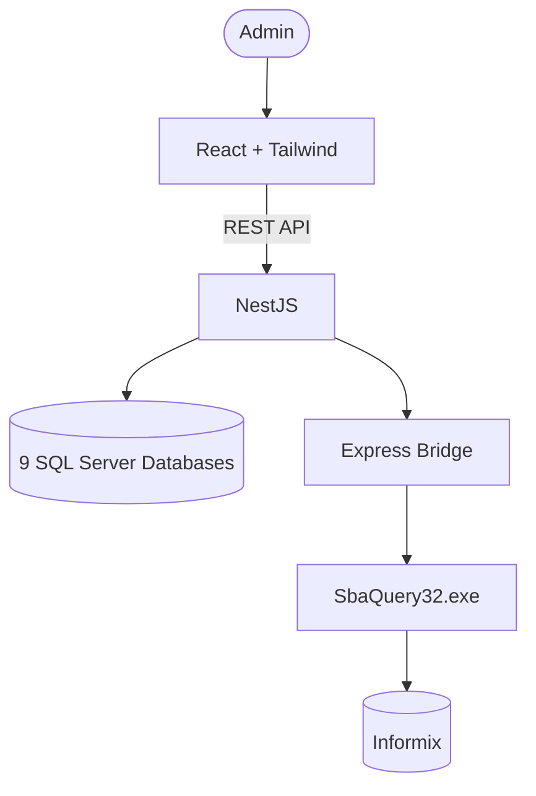

# 🛡️ AURA (AIRA User Rights Auditor)

AURA is a centralized Identity & Access Management (IAM) auditing platform developed for **AIRA Securities**. It enables administrators to search employee accounts, verify user permissions, and audit access across multiple enterprise systems through a single unified interface.

Instead of manually accessing each system individually, AURA performs parallel searches across all connected systems and presents the results in a unified dashboard with complete audit logging.

---

## ✨ Features

- 🔐 JWT Authentication & Role-based Authorization
- 🔍 Unified Employee Search across 10 Enterprise Systems
- ⚡ Parallel Query Processing with Promise.all()
- 📊 Security Audit Logs
- 🧩 Legacy Informix Integration via Bridge Service
- 📈 Dashboard & Search Analytics
- 🛡️ Fault Isolation & Error Handling
- 📄 Swagger API Documentation

---

## 🏗️ System Architecture



---

# 🔧 Tech Stack

## Backend

| Technology | Description |
|------------|-------------|
| NestJS | Backend Framework |
| TypeScript | Programming Language |
| Prisma ORM | Database ORM |
| SQL Server | Enterprise Databases |
| JWT | Authentication |
| Passport | Authorization |
| Swagger | API Documentation |

---

## Frontend

| Technology | Description |
|------------|-------------|
| React | Frontend Framework |
| Vite | Build Tool |
| Tailwind CSS | Styling |
| Axios | HTTP Client |
| SweetAlert2 | Dialog |

---

## Bridge Service

| Technology | Purpose |
|------------|---------|
| Express.js | API Gateway |
| C# CLI | Informix Connector |
| ODBC | Database Driver |

---

# 📋 Core Features

## 🔍 Unified Search

Search employee accounts across

- AIRA
- ATSRequest
- Forecast
- GlobalTrade
- IPO Plus
- MTC
- PreConfirm
- TfexMIS
- ICONIX
- SBA

### Features

- Exact Employee Search
- Parallel Database Queries
- Keyword Normalization
- Unified Response
- Active User Detection

---

## ⚡ Parallel Query Engine

The backend executes all database queries concurrently using **Promise.all()**, reducing response time while maintaining system reliability.

### Workflow

```text
Input

 ↓

Normalize Keyword

 ↓

Parallel Query

 ↓

Data Transformation

 ↓

Unified Response

 ↓

Audit Log
```

---

## 📊 Audit Logs

Every search request records

- Administrator
- Search Keyword
- IP Address
- Browser
- Timestamp

---

## 🌉 Legacy Bridge

```text
NestJS

↓

Axios

↓

Express

↓

SbaQuery32.exe

↓

Informix
```

---

# 📁 Project Structure

```text
aura/
├── README.md                                         # Project documentation, architecture overview, and screenshots
│
├── sba-bridge-service/                               # Informix Bridge Service (Port 3005)
│   ├── index.js                                      # Express server entry point handling API requests and executing the bridge
│   ├── SbaQuery32.exe                                # Compiled 32-bit C# executable for Informix ODBC access
│   ├── sba.cs                                        # Original C# source for ODBC connectivity and UTF-8 conversion
│   └── package.json                                  # Bridge service dependencies
│
├── aura-backend/                                     # Backend API (NestJS Framework)
│   ├── .env                                          # Connection strings and environment configuration
│   ├── prisma/
│   │   └── schemas/
│   │       └── schema.prisma                         # Central database schema (Users & Audit Logs)
│   ├── src/
│   │   ├── prisma/                                   # Database connection services
│   │   │   ├── prisma.module.ts                      # Registers and exports Prisma services
│   │   │   ├── central-prisma.service.ts             # Central Audit database service
│   │   │   ├── aira-prisma.service.ts                # AIRA database service
│   │   │   ├── ats-prisma.service.ts                 # ATSRequest database service
│   │   │   ├── forecast-prisma.service.ts            # Forecast database service
│   │   │   ├── gt-prisma.service.ts                  # GlobalTrade database service
│   │   │   ├── ipo-prisma.service.ts                 # IPO Plus database service
│   │   │   ├── mtc-prisma.service.ts                 # MTC database service
│   │   │   ├── preconfirm-prisma.service.ts          # PreConfirm database service
│   │   │   ├── tfex-prisma.service.ts                # TFEX MIS database service
│   │   │   ├── iconix-prisma.service.ts              # ICONIX database service
│   │   │   └── ...
│   │   │
│   │   ├── modules/
│   │   │   ├── auth/                                # Authentication and JWT management
│   │   │   │   ├── auth.controller.ts
│   │   │   │   └── auth.service.ts
│   │   │   │
│   │   │   ├── audit-log/                           # Security audit logging module
│   │   │   │   ├── audit-log.controller.ts
│   │   │   │   └── audit-log.service.ts
│   │   │   │
│   │   │   └── search/                              # Core employee search module
│   │   │       ├── search.controller.ts
│   │   │       └── search.service.ts                # Parallel query orchestration across all systems
│   │   │
│   │   ├── app.module.ts                            # Root application module
│   │   └── main.ts                                  # Application bootstrap (Port 3000/3001)
│   │
│   └── package.json
│
└── aura-frontend/                                   # Frontend Web Application (React + Vite)
    ├── index.html
    ├── package.json
    └── src/
        ├── App.jsx                                  # Main search interface and unified result dashboard
        ├── main.jsx                                 # Application entry point and route protection
        │
        ├── components/
        │   ├── Sidebar.jsx                          # Navigation sidebar and user profile panel
        │   └── UserDetailModal.jsx                  # Employee detail dialog
        │
        ├── Pages/
        │   └── DashboardPage.jsx                    # Dashboard and security audit log page
        │
        ├── features/
        │   └── auth/
        │       ├── Login.jsx                        # Administrator login page
        │       └── auth.service.js                  # Authentication API and token management
        │
        ├── services/
        │   └── search.service.js                    # API client for search and audit log requests
        │
        ├── constants/
        │   └── config.js                            # Global API endpoint configuration
        │
        └── styles/
            └── index.css                            # Tailwind CSS and custom application styles
```
---
## 🖥️ Screenshots


---

# 📡 API

## Authentication

```http
POST /auth/login
GET  /auth/profile
```

## Search

```http
POST /search
```

## Audit Logs

```http
GET /audit-logs
```

---

# 🚀 Getting Started

## Backend

```bash
cd aura-backend
npm install
npm run start:dev
```

---

## Frontend

```bash
cd aura-frontend
npm install
npm run dev
```

---

## Bridge

```bash
cd sba-bridge-service
npm install
node index.js
```

---

# 🚀 Future Enhancements

- Redis Cache
- Docker
- Kubernetes
- Elasticsearch
- Health Check
- Monitoring

---

# 👨‍💻 Developer

Developed with ❤️ by **Sitthidet Thongsawang**


